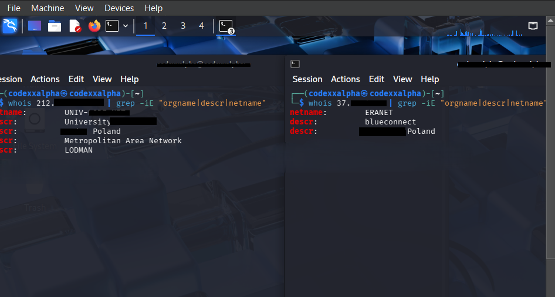

# 🕵️‍♂️ Stealth Proxy Pivot: Multi-Layered Network Evasion & C2 Infrastructure

> **⚠️ Disclaimer:** This project and its documentation are strictly for educational purposes, authorized security research, and defensive engineering (Blue Teaming) to understand advanced evasion tactics.

## 📌 Project Overview
This project demonstrates the engineering of a highly stealthy SOCKS5 proxy pipeline designed to bypass restrictive enterprise/university firewalls that employ Deep Packet Inspection (DPI). 

By converting noisy offensive traffic into trusted WebSocket streams (TCP/443) and pivoting the exit node through a mobile Carrier-Grade NAT (CGNAT) gateway, this architecture achieves complete operational anonymity and local network evasion.

## 🏗️ Architecture & Traffic Flow

**The Data Path:**
`Linux VM (Proxychains)` ➔ `SSH Local Port Forward (-D)` ➔ `Wstunnel Client (TLS/443)` ➔ `Enterprise Firewall` ➔ `Tailscale Mesh` ➔ `Android Termux (Wstunnel Server + SSH Server)` ➔ `Tethered Cellular Hotspot` ➔ `Target`

### Key Evasion Techniques Engineered:
1. **Protocol Obfuscation:** Encapsulating SSH/SOCKS traffic inside WebSockets to mimic standard, long-lived HTTPS browsing sessions.
2. **SNI Spoofing:** Overriding the TLS Server Name Indication (`--tls-sni-override`) to blend the tunnel's handshake with highly trusted local traffic (e.g., Google or University domains).
3. **Dynamic Port Forwarding:** Utilizing SSH `-D` to create a local SOCKS5 proxy, allowing offensive tools (Nmap, Metasploit) to run natively from the Linux VM without exposing attack signatures to the local network.
4. **Hardware Abstraction:** The Termux proxy node is physically separated from the cellular modem (via a tethered hotspot), creating a "Burner Gateway" that decouples the execution environment from the physical SIM identity.
5. **Dynamic IP Rotation:** Utilizing Cellular Reassociation (toggling the hotspot's cellular radio) to force the ISP's DHCP to lease a new IP from the CGNAT pool, bypassing IP-based rate limiting in < 5 seconds.

---

## 📸 Proof of Concept (Evidence)

To validate the evasion capabilities of this architecture, the following tests were conducted comparing the base local network against the routed proxy tunnel.

### Evidence 1: IP Masking via Proxychains
*Demonstrating the successful routing of terminal traffic through the mobile gateway.*

> **Analysis:** The left terminal shows the heavily monitored University IP. The right terminal, routed through `proxychains`, confirms the exit node is successfully masked behind a Mobile ISP's IP address.

### Evidence 2: ASN & ISP Evasion (WhoIs Verification)
*Demonstrating how the traffic fingerprint shifts from an academic network to a standard mobile user.*

> **Analysis:** The `whois` lookup confirms the evasion. The local network belongs to an educational institution, but traffic exiting the tunnel is registered to a Mobile Telecom Provider, allowing the reconnaissance traffic to blend into the noise of millions of daily smartphone users.

---

## 🛠️ Tool Stack
* **Command Node:** Linux VM (Debian/Kali)
* **Mesh Network:** Tailscale (WireGuard-backed NAT traversal)
* **Obfuscation Layer:** Wstunnel
* **Gateway Node:** Android OS (Termux environment)

---

## 🛡️ Blue Team / Defensive Mitigation
*How Network Administrators can detect and block this architecture.*

1. **SSL/TLS Interception (MitM):** Deploying a trusted Root CA to all managed devices allows the firewall to decrypt HTTPS traffic. This exposes the WebSocket payload as encapsulated SSH/SOCKS data rather than standard web traffic.
2. **SNI to IP Mismatch Analysis:** Advanced DPI can cross-reference the spoofed SNI against the destination IP. A connection claiming to be `google.com` but routing to a mobile ISP is a high-confidence indicator of compromise.
3. **Heuristics & Traffic Shaping:** Normal web browsing is "bursty." A WebSocket tunnel carrying a proxied Nmap scan maintains a highly persistent, unbroken, and long-lived stream of bidirectional data. Network Anomaly Detection Systems (NADS) should flag long-lived WebSockets lacking standard HTTP heartbeats.
4. **Endpoint Detection (EDR):** Monitor for local loopback port binding (e.g., `127.0.0.1:1080` for SOCKS) sustaining prolonged connections to external high ports.
